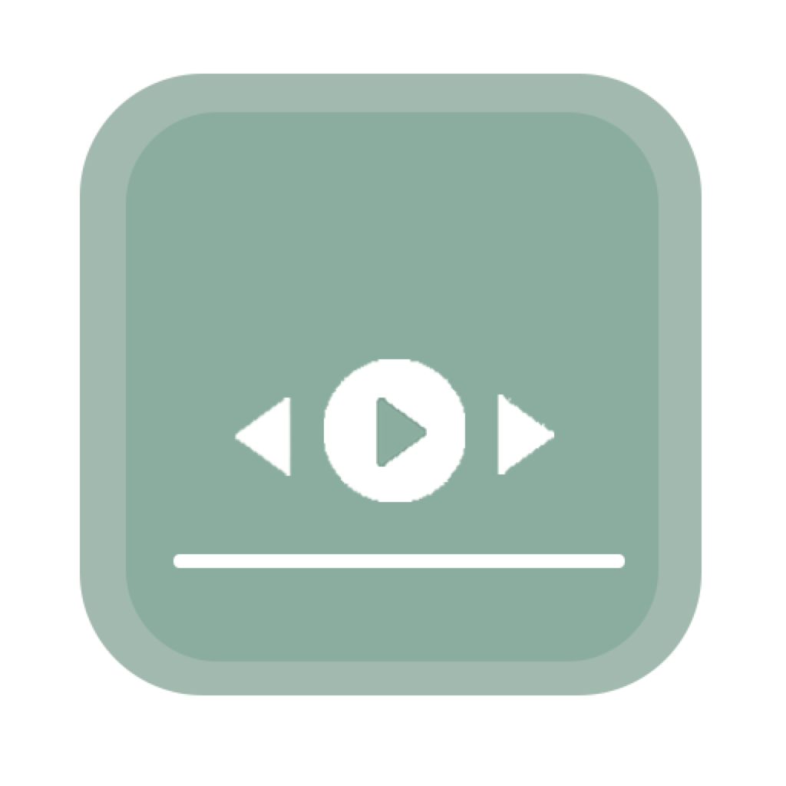

<h1>Musidio</h1>

A lightweight, widget-style app for macOS that brings seamless music controls to your desktop.

<!-- downloads -->

<!-- version -->

<!-- platform -->

 

<h4>If you want to support this project</h4>

## Features

- Support to control Spotify and Apple Music 
- Dynamic player controls that show/hide based on widget activity
- Move and lock at a specific postion on desktop
- Multi-window support with widget display across all windows
- Focus-aware behavior that brings the widget to the front when activated
- Three widget size options for flexible display
- Automatic version checks and updates

## License
Musidio is available under the [GPL-3.0 license](LICENSE).
